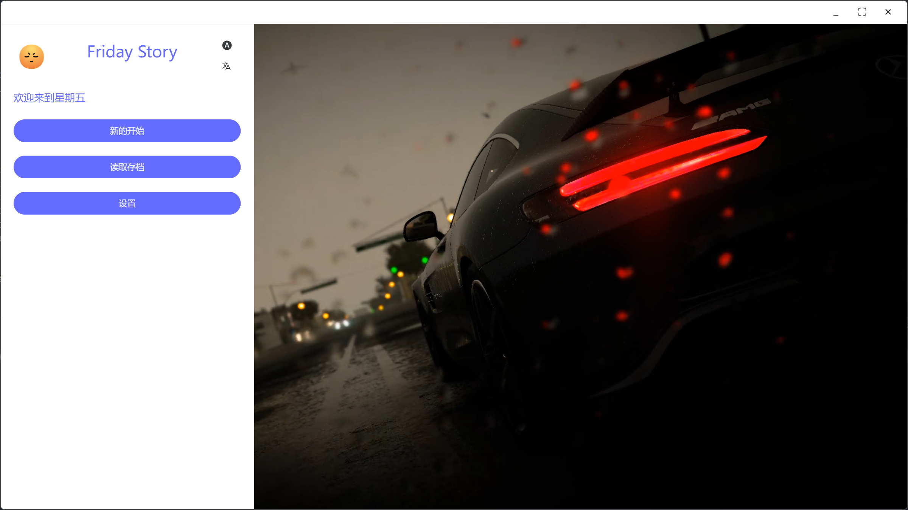
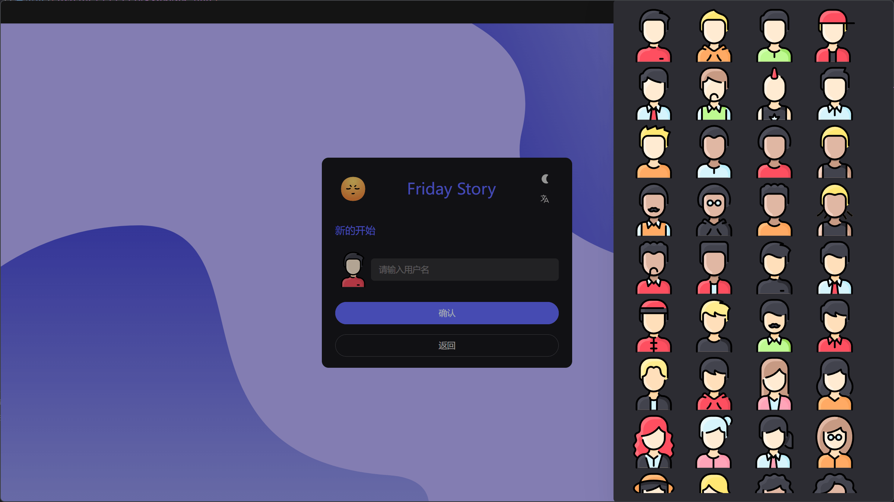
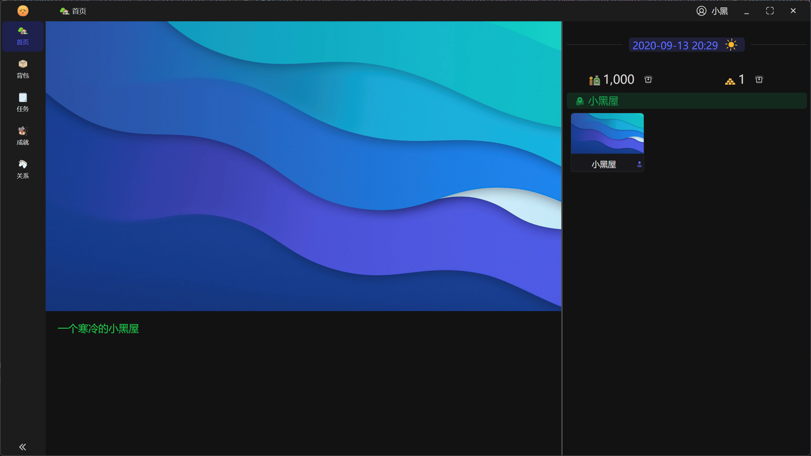
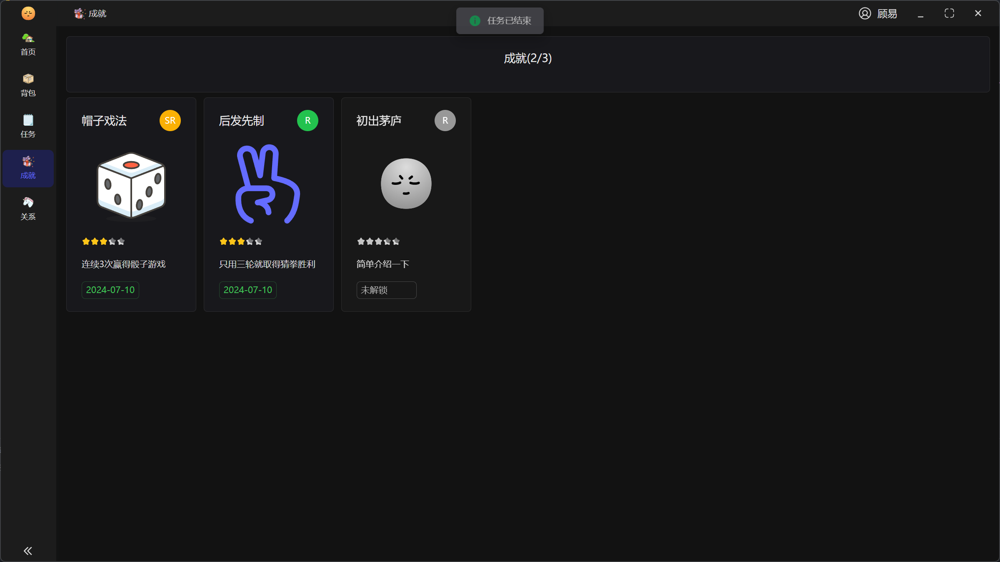
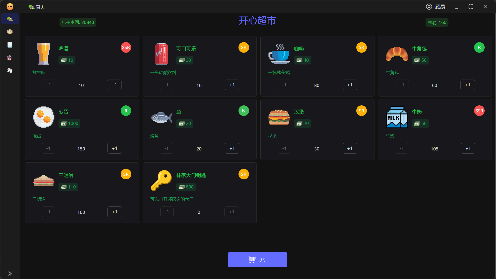
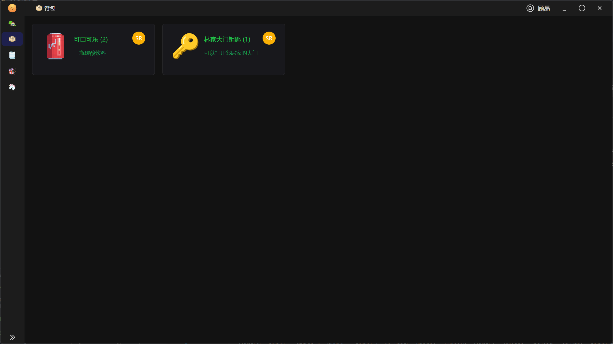

# friday-story

Friday Story is a visual novel game framework based on fridayboot-election, with a main focus on QSP and AVG like games

[中文Readme](README_CN.md)

## Support functions

- Archive module
- Map module
- Story module
- Shop module
- Backpack module

## Why not use Renpy ？

1. There are few compatible video formats, and when the interface started during testing, the content page failed to play the video normally

2. Vue is more convenient to modify styles for me

## Page Preview













## Recommended IDE Setup

- [VSCode](https://code.visualstudio.com/) + [ESLint](https://marketplace.visualstudio.com/items?itemName=dbaeumer.vscode-eslint) + [Prettier](https://marketplace.visualstudio.com/items?itemName=esbenp.prettier-vscode) + [Volar](https://marketplace.visualstudio.com/items?itemName=Vue.volar) + [TypeScript Vue Plugin (Volar)](https://marketplace.visualstudio.com/items?itemName=Vue.vscode-typescript-vue-plugin)

## Project Setup

### Install

```bash
$ pnpm i
```

### Development

```bash
$ pnpm dev
```

### Build

```bash
# For windows
$ pnpm build:win

# For macOS
$ pnpm build:mac

# For Linux
$ pnpm build:linux
```

## How to add yourself story

All data is under `/src/renderer/src/constants/data/`, and the format refers to the corresponding definition. There is no detailed document description

It is recommended that plot scripts be stored under `/resources/scripts/`. The plot is written using Renpy scripts, and some syntax is customized. For details, please refer to `demo.rpy`
